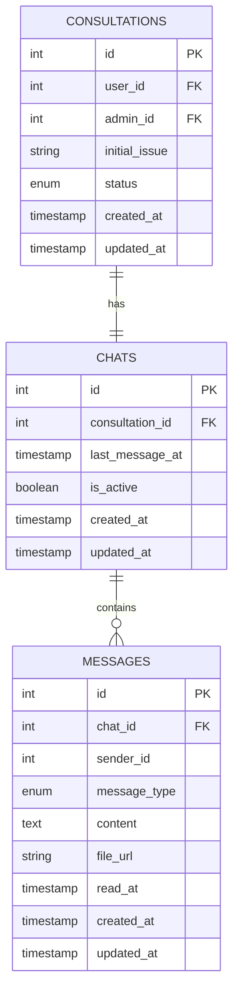

# Messaging System Entity Relationship Diagram

This document describes the relationships between the three main entities in the messaging system: Consultations, Chats, and Messages.

## Entity Relationships

## Relationship Explanation

### Consultation → Chat (1:1)
- Each consultation has exactly one chat associated with it
- The chat serves as the communication channel for the consultation
- The `consultation_id` in the `chats` table references the `id` in the `consultations` table

### Chat → Messages (1:Many)
- Each chat can contain multiple messages
- All messages belong to a specific chat
- The `chat_id` in the `messages` table references the `id` in the `chats` table

## Data Flow

1. **Consultation Creation**: When a user requests a consultation, a consultation record is created
2. **Chat Initialization**: A chat is automatically created for each consultation
3. **Message Exchange**: Users and admins exchange messages within the chat
4. **Consultation Closure**: The consultation status can be updated to 'closed' when completed

## Field Descriptions

### Consultations Table
- `id`: Unique identifier for the consultation
- `user_id`: References the user requesting the consultation
- `admin_id`: References the admin (doctor) assigned to the consultation
- `initial_issue`: Description of the user's initial concern
- `status`: Current state of the consultation (requested, active, closed)
- `created_at`: Timestamp when the consultation was created
- `updated_at`: Timestamp when the consultation was last updated

### Chats Table
- `id`: Unique identifier for the chat
- `consultation_id`: References the associated consultation
- `last_message_at`: Timestamp of the most recent message
- `is_active`: Indicates if the chat is currently active
- `created_at`: Timestamp when the chat was created
- `updated_at`: Timestamp when the chat was last updated

### Messages Table
- `id`: Unique identifier for the message
- `chat_id`: References the chat this message belongs to
- `sender_id`: References the user who sent the message
- `message_type`: Type of message (text, voice, image)
- `content`: Text content of the message (null for media messages)
- `file_url`: URL for media files (null for text messages)
- `read_at`: Timestamp when the message was read (null if unread)
- `created_at`: Timestamp when the message was created
- `updated_at`: Timestamp when the message was last updated

## Business Rules

1. A consultation must have exactly one chat
2. A chat can have zero or many messages
3. All messages must belong to a chat
4. Consultations link users with admins
5. Messages track read status for non-sender participants
6. Chats maintain activity status for UI purposes